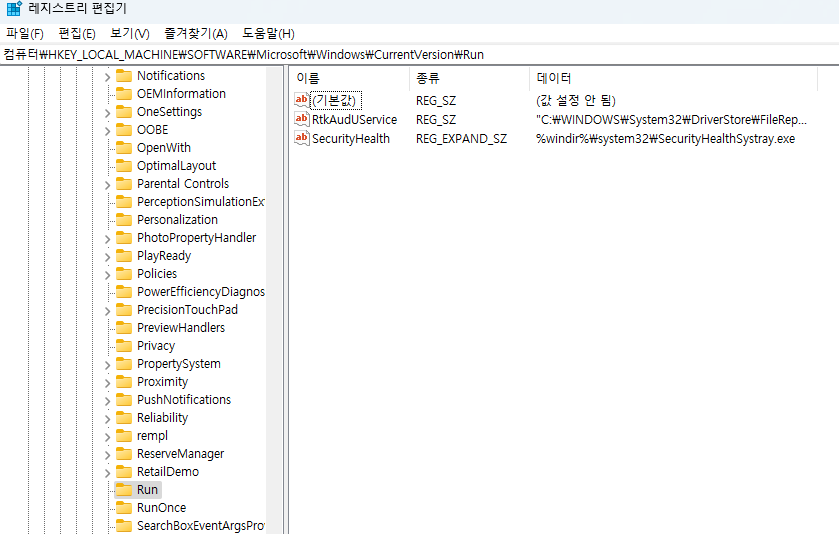
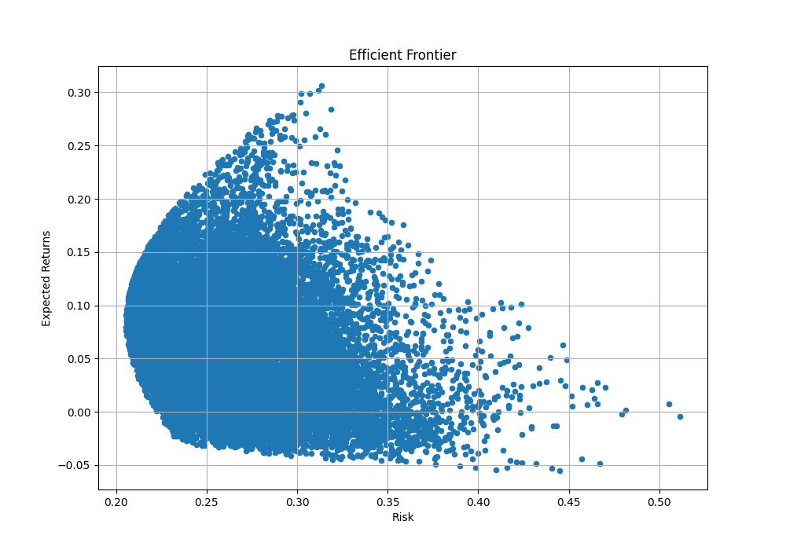
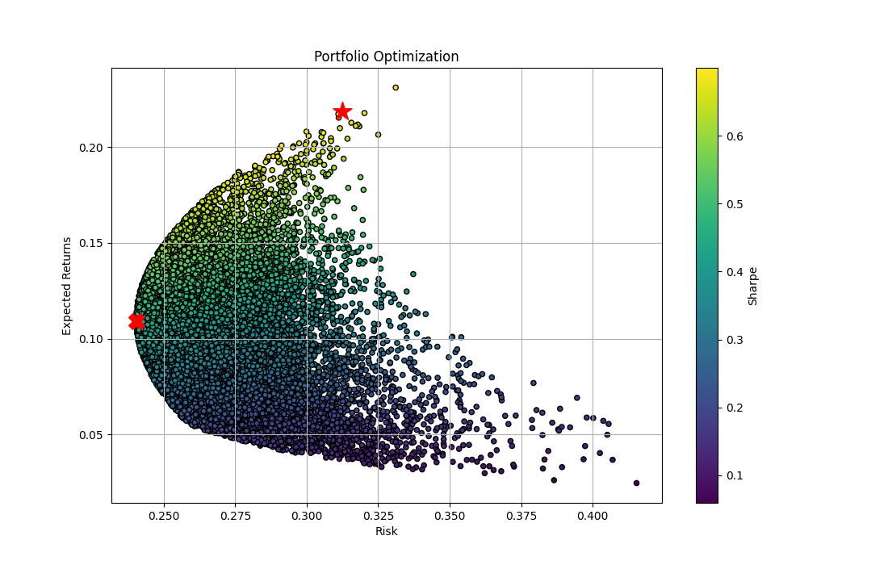

# Investment module
매일 17 : 00 에 실행하도록 설정하기

## DBUpdater.bat 설정


```txt
python <file 경로 설정>\DBUpdater.py
```
위의 코드 입력 후, 저장. 

1. win + R에서 regedit입력 -> 레지스트리 편집 실행
2. ```HKEY_LOCAL_MACHINE\SOFTWARE\Microsoft\Windows\CurrentVersion\Run``` 검색

    

3. Run 폴더 마우스 우클릭
4. 새로만들기 메뉴
5. 문자열 값 메뉴 클릭
6. ```DBUPDATER```라는 문자열 값으로 **DBUpdater.bat**경로 지정

자동으로 실행 적용 완료

## 예상
```Investment/```에서 사용할 함수(Library) 작성중..

1. Analyzer.py : MariaDB에서 Data 호출 용

2. DBUpdater.py : [Naver 금융](https://finance.naver.com)에서 회사 별 주식 등락 폭 등 다양한 정보 Crawling이후, MariaDB에 저장
3. getFinanceNews.py : [Naver 금융 뉴스](https://finance.naver.com/news/)에서 실시간 부분에서 뉴스 제목, 내용 Crawling
4. konlpy_News.py : getFinanceNews.py에서 얻어온 News 내용 분석, MariaDB에 저장
5. var.py : MariaDB, request headers, url 등 정보 저장 용도 

## 분석 기법 example

### 1. 현대 포트폴리오 이론 : Portfolio selection - by.Harry Max Markowitz(1952)
-------
평균-분산 최적화(mean-variance optimization, MVO)는 예상 수익률과 리스크의 상관관계를 활용해 포트폴리오를 최적화하는 기법.
- 수익률과 표준편차
<br>
- 효율적 투자선(Efficiant Frontier) : [Code - 몬테카를로_시뮬레이션](https://github.com/Eligae/Investment/blob/main/%EC%97%B0%EC%8A%B5/%EB%AA%AC%ED%85%8C%EC%B9%B4%EB%A5%BC%EB%A1%9C_%EC%8B%9C%EB%AE%AC%EB%A0%88%EC%9D%B4%EC%85%98.py)




### 2. 샤프 지수와 포트폴리오 최적화
-------
리스크를 최소화하고, 수익률은 최대화하는 포트폴리오 -> **샤프 지수(Sharp Ratio)**

샤프지수는 측정된 위험 단위당 수익률을 계산함. (수익률의 표준편차와 다름!)

$샤프지수 = {포트폴리오 예상 수익률 - 무위험률 \over 수익률의 표준편차}$
    


- ★ : 샤프 지수가 가장 큰 포트폴리오
- X : 리스크가 제일 작은 포트폴리오


### 3. 볼린저 밴드 지표
-------
주가의 20일 이동 평균선 기준으로, 상대적인 고점을 나타내는 상단 밴드와 상대적인 저점을 나타내는 하단 밴드로 구성됨.

주가가 상단 밴드 근처에 있을 수록, 상대적인 고점에, 주가가 하단 밴드 근처에 있을 술록 상대적인 저점에 있다고 판별가능.

밴드폭이 좁을 수록 주가 변동성이 작고, 밴드폭이 넓을 수록 변동성이 크다는 것을 나타냄.

#### <공식>
- $상단 볼린저 밴드 = 중간 볼린저 밴드 + (2 \times 표준편차)$
- $중간 볼린저 밴드 = 종가의 20일 이동평균$